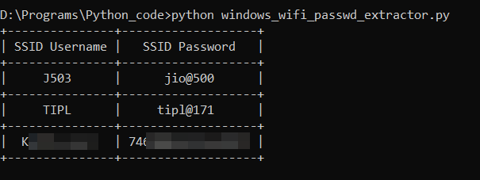

## Windows-Wifi-password-extractor
This python program will display all SSID usernames and SSID passwords you once connected to with your laptop

## How to run the program 
* Run the following command `python windows_wifi_passwd_extractor.py`

## Requirements
* Python 3.X
* beautifultable should be installled on your system

## Note

* for the program to run successfully open the CMD/Terminal and type the following command `pip install -r requirements.txt`

## Build with
* Python

## Author
* Bhaskar Pal - *Initial Work* - [bhaskarpal](https://github.com/onyx-storm) 

## License
* This project is licensed under the MIT License - see the [LICENSE.md](LICENSE) file for details

